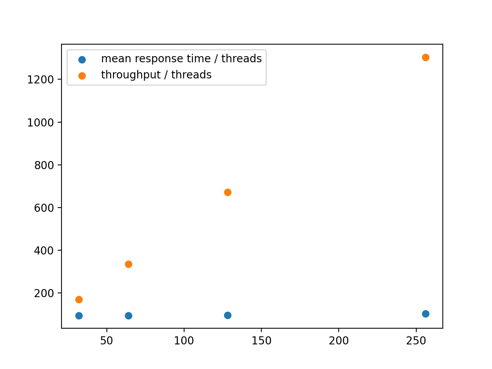

# Github Repo Link

https://github.com/qhb1001/CS6650-Assignment1

# Client Design

Object-oriented programming is adopted while developing the logic of client. The direct benefit of that is very obvious: the two clients reuse a lot of code and functionalities provided by the outer classes. I will illustrate the design of client from bottom to up. Finally you will see how these different components make up the clients.

### `phase.listener.PhaseListener`

It is an optimized listener event to launch the next phase. It supports two functions:

*   countDown()
    Decrease the counter by one. If the counter reaches zero, it will start the execution of the phase in this listener. 
*   hasNext()
    Check if the phase has been launched or not. If the phase has been started, it will not count down the counter. This function is not in the critical zone, which reduce the running time of the program.

### `phase.thread.PhaseThread` 

It represents a single thread for a certain phase. Every phase thread is bind to a phase listener. During the initialization of the thread, it receives the number of POST method to call. 

When the thread finishes, it will try to call the `countDown()` method in phase listener, which will take care of the logic to launch the next phase. 

For every POST request, it creates a `RequestRecord` object to track the detail of the request and save it. At the end of the thread, it will have a `RequestRecords` object, which includes all the information of the POST request sent.

### `phase.Phase` 

A phase is composed by a list of phase threads and a phase listener. It is initialized with the number of thread to execute, and the number of POST requests to send for each thread. It supports the following functions:

*   addNextPhase(Phase phase, double percentage):
    given the percentage and the next phase to execute, it will generate a phase listener for the phase
*   start():
    start the execution of the phase, which will then start creating and starting phase threads
*   join():
    wait for all the phase threads to finish
*   getNumberOfSuccess():
    get the number of successful requests
*   getNumberOfFailure():
    get the number of failed requests
*   getRequestRecords():
    get all the request records that the phase initialized.

### `Main`

With the help of the above classes, we can easily configure the controller of the program to start the execution. The logic is very simply

```java
# initialization
Phase phase1 = new PhaseImpl(xx, xx, xx...);
Phase phase2 = new PhaseImpl(xx, xx, xx...);
Phase phase3 = new PhaseImpl(xx, xx, xx...);

# add phase listener
phase1.addNextPhase(phase2, 0.1);
phase2.addNextPhase(phase3, 0.1);

# start the phases
phase1.start();
phase1.join();
phase2.join();
phase3.join();
```

And that's it. If we need to process every POST request, then we can make use of the `RequestRecords` object in every phase. For example, we can get the number of successful requests with the following code.

```java
RequestRecords requestRecords = new RequestRecords();
requestRecords.addRequestRecords(phase1.getRequestRecords());
requestRecords.addRequestRecords(phase2.getRequestRecords());
requestRecords.addRequestRecords(phase3.getRequestRecords());
int success = phase1.getNumberOfSuccess() + phase2.getNumberOfSuccess() + phase3.getNumberOfSuccess();
```

# Estimation & Output

All of the Estimations are based on the throughput of a single thread: 11.4 (tested locally by running 10000 requests in a single thread)

| Wall Time              | 32 Threads | 64 Threads | 128 Threads | 256 Threads |
| ---------------------- | ---------- | ---------- | ----------- | ----------- |
| Lower Bound Estimation | 493.4      | 246.7      | 123.3       | 61.6        |
| Output - Client Part 1 | 1052.8     | 528.2      | 267.3       | 137.5       |
| Output - Client Part 2 | 1061.6     | 535.5      | 267.8       | 137.9       |
| Upper Bound Estimation | 19736.8    | 986.8      | 493.2       | 246.4       |

### 32-threads system estimation 

*   Phase 1
    threadsNum: 8, requestPerThread: 5000, number of requests in phase: 40000
*   Phase 2 
    threadsNum: 32, requestPerThread: 3750, number of requests in phase: 120000
*   Phase 3
    threadsNum: 8, requestPerThread: 2500, number of requests in phase: 20000

Number of requests in three phases = 40000 + 120000 + 20000 = 180000

Wall time, upper bound estimation (assume that this is a 8-threads system): 180000 / (8 * 11.4) = 19736.8

Wall time, lower bound estimation (assume that this is a 32-threads system): 180000 / (32 * 11.4) = 493.4

### 64-threads system estimation 

*   Phase 1
    threadsNum: 16, requestPerThread: 2500, number of requests in phase: 40000
*   Phase 2 
    threadsNum: 64, requestPerThread: 1875, number of requests in phase: 120000
*   Phase 3
    threadsNum: 16, requestPerThread: 1250, number of requests in phase: 20000

Number of requests in three phases = 40000 + 120000 + 20000 = 180000

Wall time, upper bound estimation (assume that this is a 16-threads system): 180000 / (16 * 11.4) = 986.8

Wall time, lower bound estimation (assume that this is a 64-threads system): 180000 / (64 * 11.4) = 246.7

### 128-threads system estimation 

*   Phase 1
    threadsNum: 32, requestPerThread: 1250, number of requests in phase: 40000
*   Phase 2 
    threadsNum: 128, requestPerThread: 937, number of requests in phase: 119936
*   Phase 3
    threadsNum: 32, requestPerThread: 625, number of requests in phase: 20000

Number of requests in three phases = 40000 + 119936 + 20000 = 179936

Wall time, upper bound estimation (assume that this is a 32-threads system): 179936 / (32 * 11.4) = 493.2

Wall time, lower bound estimation (assume that this is a 128-threads system): 179936 / (128 * 11.4) = 123.3

### 256-threads system estimation 

*   Phase 1
    threadsNum: 64, requestPerThread: 625, number of requests in phase: 40000
*   Phase 2 
    threadsNum: 256, requestPerThread: 468, number of requests in phase: 119808
*   Phase 3
    threadsNum: 64, requestPerThread: 312, number of requests in phase: 19968

Number of requests in three phases = 40000 + 119808 + 19968 = 179776

Wall time, upper bound estimation (assume that this is a 64-threads system): 179776 / (64 * 11.4) = 246.4

Wall time, lower bound estimation (assume that this is a 256-threads system): 179776 / (256 * 11.4) = 61.6

# Result 

## Part 1


### 32-threads


### 64-threads


### 128-threads


### 256-threads


## Part 2



### 32-threads


### 64-threads


### 128-threads


### 256-threads


# Additional minor class doc

### `util.range.Range` class

It represents a continuous range of integers. Besides the functionality to get the size of the range, it also supports to get a random number from the given range. 

The class is used to generate a random number for skier ID, lift number, season, etc.

### `util.range.DisjointRangeGenerator` class

The class adopts the iterator pattern. It supports the `hasNext()` method and `next()` method, which make it easily to use for a series of disjoint range. 

The class is used to generate a series of disjoint range for the skier ID.

### `util.records.RequestRecord` class

It represents a record for a request. The data structure includes the status code, start time of the request, along with the end time of the request.

### `util.records.RequestRecords` class

Maintains a list of request records. It includes the operation to manipulate a list of request records, such as getting the mean response time for all the request records. 

### `util.Timer` class

It is the class to count the time duration between certain piece of code. 
